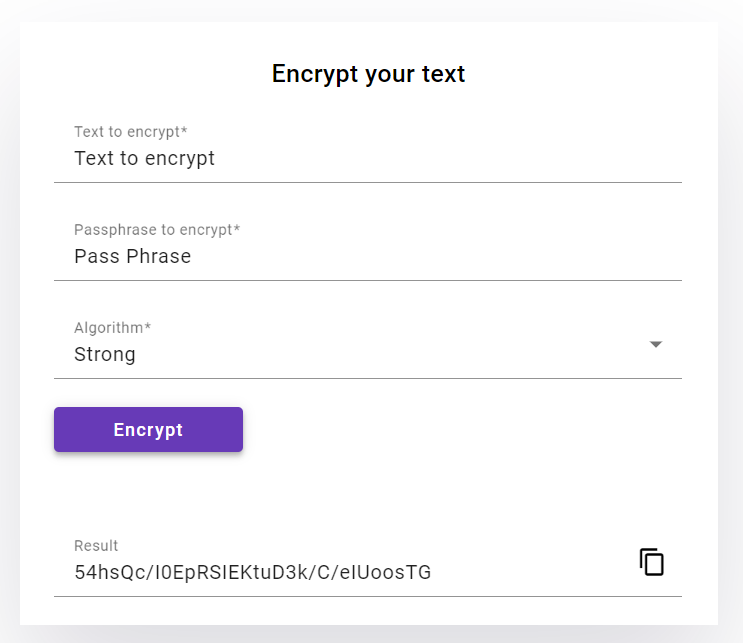
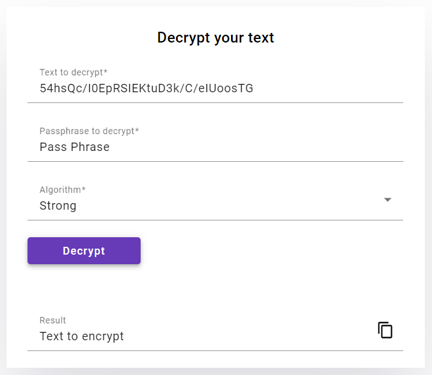

# Symmetric Encryption/Decryption Frontend  
  
This is an Angular application that provides a simple user interface for encrypting and decrypting text using the Jasypt Encryption/Decryption API.  

This project was generated with [Angular CLI](https://github.com/angular/angular-cli) version 16.1.5.


## Table of Contents

- [Getting Started](#getting-started)
    - [Prerequisites](#prerequisites)
    - [Installation](#installation)
- [Usage](#usage)
    - [Running the application](#running-the-application)
      - [Steps](#steps)
    - [Build](#build)
    - [Running unit tests](#running-unit-tests)
    - [Running lint verification](#running-lint-verification)
- [Screenshots of the project](#screenshots-of-the-project)

# Getting started

## Prerequisites  
  
- Node.js (version 12 or higher)  
- Angular CLI  
  
## Installation

1. Clone the repository: 
```sh
git clone https://github.com/mohammed-lahbil/symmetric-encryption-front.git
```
2. Navigate to the project directory:
```sh
cd symmetric-encryption-front
```
3. Install required dependencies:
```sh
npm install
```


# Usage
  
## Running the application  
  
Start the development server:
```sh
ng serve
```
or
```sh
npm run start
```
By default, the application will run on port 4200. You can access the frontend at `http://localhost:4200/`.  
  
### Steps  
  
1. Enter the text value you want to encrypt or decrypt.  
2. Enter the passphrase for symmetric encryption/decryption.  
3. Select the algorithm to use for encryption/decryption.  
4. Click the "Encrypt" or "Decrypt" button to perform the respective operation.  
  
The encrypted or decrypted value will be displayed on the page.  

__NB:__ The `symmetric-encryption-back` application must be running in order to get encrypted or decrypted values.

## Build

Run `ng build` or `npm run build` to build the project. The build artifacts will be stored in the `dist/` directory.
```sh
ng build
```
or
```sh
npm run build
```

## Running unit tests

Run `ng test` or `npm run test` to execute the unit tests via [Karma](https://karma-runner.github.io).
```sh
ng test
```
or
```sh
npm run test
```
Run `ng test --code-coverage` or `npm run coverage` to execute the unit tests and get the code coverage of the project.
```sh
ng test --code-coverage
```
or
```sh
npm run coverage
```

## Running lint verification

Run `ng lint` or `npm run lint` to execute lint verification.
```sh
ng lint
```
or
```sh
npm run lint
```

# Screenshots of the project

## Encryption


## Decryption

